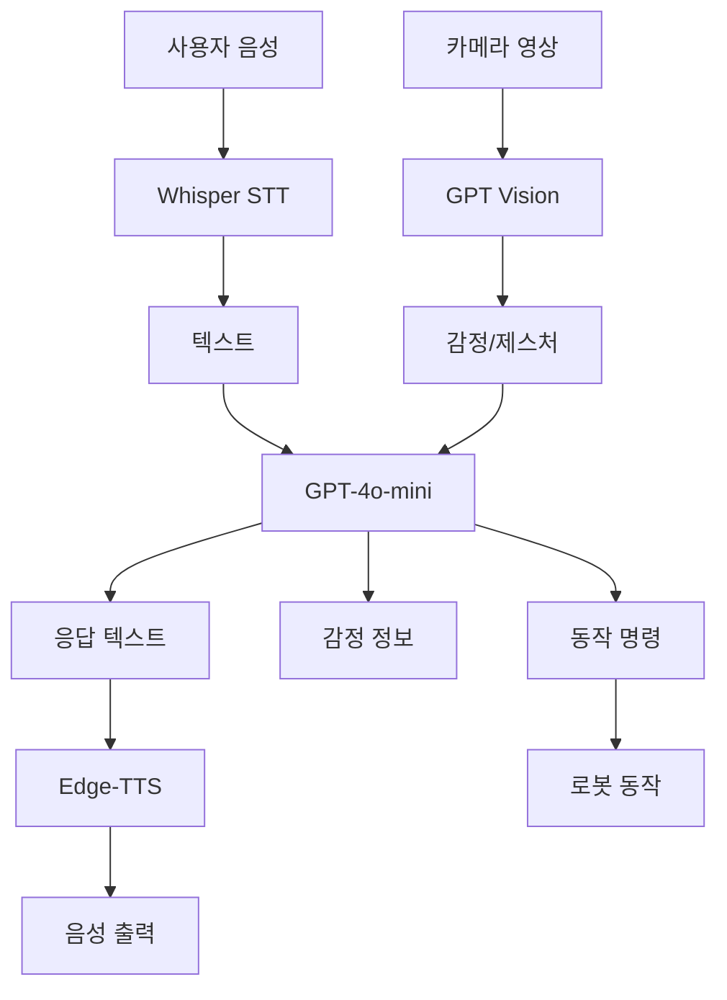

# NLP-Humanoid

# 🤖 NLP 기반 반려로봇 시스템

<div align="center">


**음성 대화, 감정 분석, 실시간 응답이 가능한 지능형 반려로봇**


</div>

---

## 📋 프로젝트 소개

본 프로젝트는 **OpenAI의 GPT-4o-mini, Whisper(STT), Edge-TTS**를 활용하여 
실시간 음성 대화 및 감정 분석이 가능한 반려로봇 시스템입니다.

사용자의 음성을 인식하고, 표정/제스처를 분석하며, 상황에 맞는 감정적인 응답과 
로봇 동작을 생성합니다.

### ✨ 주요 특징
- 🎤 **실시간 음성 인식**: OpenAI Whisper를 통한 정확한 STT
- 🧠 **지능형 대화**: GPT-4o-mini 기반 자연어 이해 및 응답 생성
- 😊 **감정 분석**: Vision API로 표정/제스처 인식 + 텍스트 감정 분석
- 🗣️ **감정 기반 TTS**: Edge-TTS로 상황별 적절한 음성 출력
- 🤖 **로봇 제어**: 대화 내용에 따른 자동 동작 명령 생성

---

## 🛠️ 기술 스택

### AI/ML
| 기술 | 용도 |
|------|------|
| **OpenAI Whisper** | 음성 → 텍스트 변환 (STT) |
| **GPT-4o-mini** | 자연어 이해, 응답 생성, 동작 명령 생성 |
| **GPT-4o Vision** | 이미지 기반 감정/제스처 인식 |
| **Edge-TTS** | 텍스트 → 음성 합성 (TTS) |

### 시스템
| 분류 | 기술 |
|------|------|
| **Language** | Python 3.11+ |
| **Audio** | PyAudio, sounddevice |
| **Vision** | OpenCV |
| **통신** | Serial Communication, GPIO |
| **비동기** | Threading, Asyncio |

---

## 🎯 프로젝트 목표

- 🤖 **자연스러운 인간-로봇 상호작용**: 음성과 시각 정보를 통합한 맥락 인식
- ⚡ **실시간 응답**: 2-3초 이내의 빠른 응답 속도 달성
- 🏠 **스마트홈 연동**: IoT 기기 제어를 통한 실용성 확보
- 💡 **확장성**: 모듈화된 아키텍처로 기능 추가 용이

## 🏗️ 시스템 아키텍처

### 전체 흐름

```
subgraph Core["🧠 핵심 처리 계층 (Core Layer)"]
    B --> E[텍스트 데이터]
    D --> F[시각 컨텍스트]
    E --> G{GPT-4o-mini<br/>중앙 제어기}
    F --> G
    H[(대화 기록<br/>Memory)] -.-> G
end

subgraph Output["🔊 출력 계층 (Output Layer)"]
    G --> I[응답 텍스트]
    G --> J[감정 정보]
    G --> K[동작 명령<br/>JSON]
    
    I --> L[Edge-TTS<br/>음성 합성]
    L --> M[스피커 출력]
    
    K --> N[로봇 제어<br/>Serial/GPIO]
    N --> O[서보 모터]
end

style Input fill:#2d2d2d,stroke:#fff,stroke-width:2px,color:#fff
style Core fill:#1e3a8a,stroke:#fff,stroke-width:2px,color:#fff
style Output fill:#064e3b,stroke:#fff,stroke-width:2px,color:#fff
```
```

### 🔄 데이터 흐름

1. **입력 수집**: PyAudio로 실시간 음성 스트림, OpenCV로 카메라 프레임을 동시에 캡처
2. **전처리**: Whisper로 음성을 텍스트로 변환, GPT-4o Vision으로 이미지에서 감정/제스처 추출
3. **AI 추론**: GPT-4o-mini가 대화 기록(Memory)을 참조하여 응답 생성
4. **출력 분기**: 
   - 텍스트 → Edge-TTS → 음성 출력
   - 감정 정보 → 상태 저장
   - 동작 명령 → 로봇 하드웨어 제어

### 📦 주요 컴포넌트

| 계층 | 컴포넌트 | 기술 | 역할 |
|------|---------|------|------|
| **입력** | 오디오 캡처 | `PyAudio` | 마이크에서 실시간 음성 스트림 수집 |
| **입력** | 영상 캡처 | `OpenCV` | 카메라 프레임 캡처 및 전처리 |
| **처리** | 음성 인식 | `openai-whisper` | 음성을 텍스트로 변환 (STT) |
| **처리** | 시각 분석 | `GPT-4o Vision` | 이미지에서 감정, 제스처, 상황 추출 |
| **처리** | 중앙 제어 | `GPT-4o-mini` | 대화 맥락 이해, 응답 생성, 동작 결정 |
| **처리** | 상태 관리 | `Conversation History` | 대화 기록 유지 및 맥락 전달 |
| **출력** | 음성 합성 | `Edge-TTS` | 텍스트를 자연스러운 음성으로 변환 |
| **출력** | 로봇 제어 | `Serial/GPIO` | JSON 명령을 하드웨어 신호로 변환 |

### ⚡ 핵심 설계 원칙

- **비동기 처리**: STT와 Vision 분석을 병렬로 실행하여 응답 지연 최소화
- **모듈화**: 각 계층이 독립적으로 동작하여 확장성 확보
- **상태 유지**: GPT의 Stateless 한계를 대화 기록으로 보완
- **멀티모달**: 음성, 영상, 텍스트를 통합 처리하여 자연스러운 상호작용 구현
```
# 저장소 클론해서 로컬로 가져오기
```
git clone https://github.com/pocky75/NLP-Humanoid.git
```
# OpenAI API키 넣기


# 시리얼 포트 지정
```
python test.py
```


# 프로그램 실행
```
python companion.robot.py
```


# 실행화면


# 연결 성공 로그


# 시연영상

https://github.com/user-attachments/assets/e955b6d2-11ab-4f62-a93a-81bf78fd9518

# 향후개선사항‼️
1️⃣ 한국어 인식 정확도 향상 : 현재 Whisper 기반 STT는 기본 대화 수준에서 동작하고 있기에 향후 잡음 환경에서의 인식률 개선, 방언 및 전문 용어 인식, 화자 구분 기능 등을 추가하여 실생활에서 더 정확하게 음성을 인식할 수 있도록 개선 예정

2️⃣ 감정 인식 고도화 : 현재는 기본 감정 표현만 지원하고 있으므로, 향후 멀티모달 감정 인식을 고도화하여 더 자연스럽고 인간적인 상호작용이 가능하도록 발전시킬 예정

3️⃣ IoT 기기 제어 : 현재 라즈베리파이를 활용한 간단한 조명 키기정도만 가능하기에, 추후 음성 명령 추가와 스마트 플러그 제어, 온도/습도 센서 모니터링 등 실생활에서 유용한 스마트홈 기능 추가 예정
